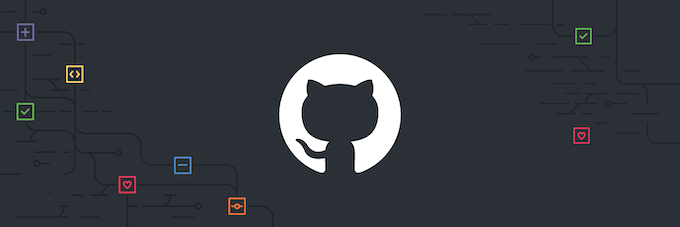

## Henrique F. Moreira - Desenvolvedor de Websites e outros!
Python, Django, Flask, HTML5, CSS3, JavaScript e o que mais der na telha...

  
    
    
    
    
    
    
    
    
  
  ㅤ
  .....................................................................................ㅤTecnologias_Principais

##

  
  
  

## No que venho trabalhando:

  
  

##

  

    <strong>Mais sobre mim:</strong>
  

  <h2>SOBRE MIM</h2>
  <table>
    <tr>
      <td valign="top">
        
Olá! Meu nome é <strong>Henrique Ferreira Moreira</strong> e tenho 18 anos. Sou um desenvolvedor curioso que começou pelo Minecraft em 2020, mas que hoje já desenvolveu <strong>websites completos</strong>, jogos simples para o console de <strong>Python/C#</strong>, entre outros. Hoje foco em minha carreira como <strong>desenvolvedor Backend</strong> com os frameworks <strong>Django e Flask</strong>, onde já sou capaz de desenvolver sites completos graças ao meu ensino <strong>técnico de informática</strong> e usando agentes de IA avançados para agilizar processos e desenvolver designs mais complexos (ainda mantendo a organização, claro).

        
Apesar de não ser o meu foco, tenho considerável conhecimento em <strong>design, HTML, CSS e JavaScript</strong>. Nada muito profundo, mas suficiente para desenvolver sites com a ajuda de LLMs enquanto ainda mantenho a compreensão de cada parte do projeto.

        
Compartilho cada uma de minhas descobertas e experimentos através de redes sociais como LinkedIn e GitHub, mas você também pode conversar comigo por mensagens no WhatsApp ou através do meu e-mail profissional: <strong>henriquefmoreira2@gmail.com</strong>.

        
Estou sempre disposto a aprender algo novo e me adapto rapidamente aos desafios que surgem no meio do caminho! :)

      </td>
      <td valign="top" align="center">
        
        
        
....................................................................

      </td>
    </tr>
  </table>

